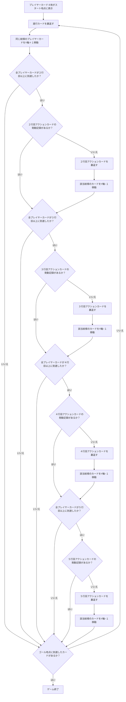

# 概要
### タイトル：**Trump Card Derby**
### 技術スタック  
|分野|内容|
|:---|:---|
|フレームワーク|Vite|
|言語|TypeScript|
|アーキテクト|Atomic Design with custom hook|
|ライブラリー<br>（必要に応じて追加）|React19<br>motion(Not framer-motion)<br>Tailwind CSS<br>TanStack Router|

### 実装時必ず守ること（一番大事）
- 実装前に必ず確認を得てから実装すること
- 確認なしの実装は厳禁
- **ライブラリページを最初に作成し、各コンポーネントを作成後すぐに確認できるようにすること**
- Atom -> Molecule -> Organism ... の流れで作成すること

### コード品質ガイドライン
1. **バレルエクスポート（Barrel Export）の使用**
   - 各ディレクトリ（atoms, molecules, organisms等）に `index.ts` を配置
   - インポート文を簡潔に保つ
   - 例：`import { Card, Tile, Button } from '@/components/atoms'`

2. **インポート文へのコメント追加**
   - 各インポートに日本語コメントを追加し、何をインポートしているか明確にする
   - 例：`import { Card } from '@/components/atoms' // カードコンポーネント`

### 構成
- プレイヤーフィルド：４x６のタイルフィルド
- アクションカードフィルド：１x６のタイルフィルド
- プレイヤーカード：４枚
- 進行カード：１枚
- アクションカード：１枚

### 構成仕様
|プレイヤーフィルド||
|--|--|
|大きさ|1x1のタイル|
|スタート地点|１行目|
|ゴール地点|６行目|
|カードの配置地点|フィルドの１行目|

|アクションフィルド||
|--|--|
|大きさ|1x1のタイル|
|カードの配置地点|フィルドの２行目から５行目まで１枚づづ|

|**カード（裏）**
- 大きさ：９：１６比率
- 絵：アニメ風の熊（生成必要）
- 絵の配置：カードの真ん中（横、縦）に１個

**カード（表）**
- 大きさ：９：１６比率
- 絵：トランプカード紋様（Hearts, Diamonds, Clubs, Spades）
- 絵の配置：カードの真ん中（横、縦）に１個

### カードの種類

ゲームには3種類のカードが存在します：

**1. プレイヤーカード（Player Card）**
- 枚数：4枚（各紋様1枚ずつ）
- 配置：プレイヤーフィールド（緑系タイル）
- サイズ：通常サイズ（90x160px）
- 動作：進行カードの結果に応じて前進・後退
- ホバーアニメーション：なし

**2. アクションカード（Action Card）**
- 枚数：4枚（2-5行目に各1枚）
- 配置：アクションフィールド（紫系タイル）
- サイズ：通常サイズ（90x160px）
- 動作：全プレイヤーが該当行に到達すると裏返り、ペナルティ対象を決定
- ホバーアニメーション：なし（クリック不可）

**3. 進行カード（Proceeding Card）**
- 枚数：1枚
- 配置：専用タイル（オレンジ系タイル）
- サイズ：1.2倍サイズ（108x192px）
- 動作：ユーザーがクリックして裏返し、前進する紋様を決定
- ホバーアニメーション：あり（`hover:scale-105`）

**特記事項**
- 3種類のカードは見た目（表・裏）は共通
- サイズとホバーアニメーションのみ異なる
- `cardType` propで種類を区別

### 表示仕様
- ゲーム画面とライブラリページ間の切り替えボタンを配置
- ゲーム終了時に勝利したカードの紋様を表示し、再スタートボタンを表示

### プレイ方法
1. ユーザーが進行カードをクリックして裏返す
2. 進行カードの紋様に当たるプレイヤーカードをプレイヤーフィルドでY軸＋１（アニメーション付き移動）
3. すべてのプレイヤー（４人）が２行目以上に着くと、２行にあるアクションカードを裏返す
4. 裏返したアクションカードの紋様のプレイヤーカードをY軸−１（アニメーション付き移動）
5. アクションカードの効果は１回限定で、１回裏返したカードは効果を失う
6. ３行から５行までアクションカードフィルドと進行カードフィルドの挙動は同様
7. 到着地点に一番最初に着いたプレイヤーカードが勝利
8. 勝利後、勝利した紋様を表示し、再スタートボタンで新しいゲームを開始可能

### プレイ方法のフローチャート



| ノード ID | 関数/ロジック名 | 役割 (Role) |
| :--- | :--- | :--- |
| **B** | `DrawProceedingCard()` | 4つの紋様の中から一つをランダムに決定し返します。 |
| **C** | `MoveCard(suit)` | 決定された紋様を持つカードのY座標 (`position_y`) を +1 します。 |
| **D, F, K, O** | `CheckAllReached(row_num)` | 全てのカードのY座標が指定された行 (`row_num`) 以上であるかを確認します。 |
| **E, I, N, R** | `IsActionTriggered(row_num)` | `ActionHistory` を参照し、指定行のアクションが既に発動したかどうかを確認します。 |
| **G, L, P, S** | `TriggerAction(row_num)` | `ActionHistory` を更新し、ペナルティ対象の紋様を決定します。 |
| **H, M, Q, T** | `ApplyPenalty(suit)` | ペナルティ対象の紋様を持つカードのY座標を -1 します（後退）。 |
| **J** | `CheckForWinner()` | カードのY座標が `GoalRow` 以上であるカードがあるかどうかを確認します（ゲーム終了条件）。 |

## 実装計画

### ディレクトリ構造
```
src/
├── components/
│   ├── atoms/          # 基本コンポーネント（Card, Tile等）
│   ├── molecules/      # 複合コンポーネント（PlayerField, ActionField等）
│   ├── organisms/      # 大規模コンポーネント（GameBoard等）
│   └── templates/      # ページテンプレート
├── pages/              # ページコンポーネント
├── hooks/              # カスタムフック
├── types/              # 型定義
├── utils/              # ユーティリティ・定数
├── assets/             # 画像・SVG等
├── App.tsx
└── main.tsx
```

### フェーズ1: 基盤構築 (完了)
#### [NEW] [index.ts](file:///Users/gomserker/Desktop/card-derby/src/types/index.ts)
- トランプ紋様の型定義 (`Suit`: Hearts, Diamonds, Clubs, Spades)
- カード状態の型定義 (`CardState`, `PlayerCard`, `ActionCard`)
- ゲーム状態の型定義 (`GameState`, `ActionHistory`)
- 位置情報の型定義 (`Position`)

#### [NEW] [constants.ts](file:///Users/gomserker/Desktop/card-derby/src/utils/constants.ts)
- ゲーム定数の定義（フィールドサイズ、行数、カード枚数など）
- カードサイズのバリエーション定義
  - 通常サイズ: 90x160px (9:16比率)
  - 1.2倍サイズ: 108x192px (進行カード用)
- タイルサイズ定義: 110x180px (カードより少し大きめ)

---

### フェーズ2: Atomic Design - Atoms (完了)
#### [NEW] [Card.tsx](file:///Users/gomserker/Desktop/card-derby/src/components/atoms/Card.tsx)
- カードの基本コンポーネント
- 表裏の状態管理
- カード反転アニメーション（motion使用）
- サイズバリエーション対応（通常サイズ、1.2倍サイズ）
- カードタイプ対応（`cardType` prop）：
  - `'player'`: プレイヤーカード（ホバーアニメーションなし）
  - `'action'`: アクションカード（ホバーアニメーションなし、クリック不可）
  - `'proceeding'`: 進行カード（ホバーアニメーション `hover:scale-105`）
- クリックイベント対応

#### [NEW] [Tile.tsx](file:///Users/gomserker/Desktop/card-derby/src/components/atoms/Tile.tsx)
- フィールドタイルの基本コンポーネント
- 背景色の切り替え：
  - プレイヤーフィールド：緑系（`bg-field-green-400`）
  - アクションフィールド：紫系（`bg-field-purple-400`）
  - 進行カードタイル：オレンジ系（`bg-field-orange-400`）

#### [NEW] [Button.tsx](file:///Users/gomserker/Desktop/card-derby/src/components/atoms/Button.tsx)
- ボタンコンポーネント（ページ切り替え、再スタート用）

---

### フェーズ3: Atomic Design - Molecules (完了)
#### [NEW] [PlayerField.tsx](file:///Users/gomserker/Desktop/card-derby/src/components/molecules/PlayerField.tsx)
- 4x6のプレイヤーフィルド
- タイルの配置とレイアウト
- プレイヤーカードのY軸移動アニメーション（motion使用）

#### [NEW] [ActionField.tsx](file:///Users/gomserker/Desktop/card-derby/src/components/molecules/ActionField.tsx)
- 1x6のアクションカードフィルド
- アクションカードの配置（2-5行目）

#### [NEW] [GameResult.tsx](file:///Users/gomserker/Desktop/card-derby/src/components/molecules/GameResult.tsx)
- 勝利した紋様の表示
- 再スタートボタンの配置

---

### フェーズ4: Custom Hooks (完了)
#### [NEW] [useGameLogic.ts](file:///Users/gomserker/Desktop/card-derby/src/hooks/useGameLogic.ts)
- ゲームロジックの実装
- フローチャートに基づく関数群の実装
- 進行カードクリックハンドラー
- ActionHistory管理（実装しながら構造を決定）

---

### フェーズ5: Atomic Design - Organisms (完了)
#### [NEW] [GameBoard.tsx](file:///Users/gomserker/Desktop/card-derby/src/components/organisms/GameBoard.tsx)
- プレイヤーフィルドとアクションフィルドの統合
- 進行カード（1.2倍サイズ）の配置
- ゲーム結果表示の統合

---

### フェーズ6: カードアニメーションの実装 (完了)

> [!IMPORTANT]
> Moleculeレベルでカードの表裏アニメーションを実装します。

#### カードタイプ別アニメーション仕様

**1. プレイヤーカード**
- 表裏アニメーションなし
- 常に表面を表示

**2. アクションカード**
- 裏面→表面の一方向のみ
- 一度表になったら元に戻せない
- アニメーション：3D回転フリップ（motion使用）

**3. 進行カード**
- 初期表示：裏面（ユーザーがクリックで表に）
- 1回目のクリック：
  - 裏面→表面：3D回転フリップアニメーション
  - 表面→裏面：3D回転フリップアニメーション
- 2回目以降のクリック：
  - 裏面→表面：横にスライドして消えるアニメーション
  - 新しいカードが横からスライドイン

#### 実装対象
- Card.tsxに`animationType` prop追加
- [x] **[FIX]** PlayerFieldでのカード移動アニメーション (`layoutId`追加)
- [x] **[FIX]** カードの重なり順修正 (`z-index`追加)
- ProceedingCardArea.tsxコンポーネント作成

---

### フェーズ7: Pages & Library (完了)
#### [NEW] ルーター導入
- パッケージ追加: `@tanstack/react-router`, `@tanstack/router-devtools`
- ルーティング設定:
  - RootRoute作成
  - ページルート作成
  - App.tsxでのRouterProvider設定
#### [NEW] [GamePage.tsx](file:///Users/gomserker/Desktop/card-derby/src/pages/GamePage.tsx)
- メインゲームページ
- ライブラリページへの切り替えボタン（Linkコンポーネント使用）

#### [NEW] [router.tsx](file:///Users/gomserker/Desktop/card-derby/src/router.tsx)
- TanStack Routerのルート定義
- ルート:
  - `/`: GamePage（ベース）
  - `/library`: LibraryPage（モーダル/サイドバーとしてGamePageの上に表示）
- devtools導入

#### [NEW] [LibraryPage.tsx](file:///Users/gomserker/Desktop/card-derby/src/pages/LibraryPage.tsx)
- コンポーネントライブラリページ
- サブページ構成：
  - Atomsサブページ（Card、Tile、Button等の表示）
  - Moleculesサブページ（PlayerField、ActionField等の表示）
  - Organismsサブページ（GameBoard等の表示）
- 各コンポーネントのサイズバリエーション確認用セクション
- ゲームページへの切り替えボタン（Linkコンポーネント使用）

---

### フェーズ7: アセット準備
- スケルトン画像（プレースホルダー）の作成
  - カード裏面プレースホルダー（9:16比率）
  - トランプ紋様プレースホルダー4種類（Hearts, Diamonds, Clubs, Spades）
  - `src/assets/images/` に保存
- 最終アセットは後でGeminiで生成予定

---

### フェーズ8: Publishing & Deployment (完了)
#### [NEW] GitHub Pages公開
- Git初期化とRemote設定
- Vite設定 (`base: '/card-derby/'`)
- GitHub Actions Workflow (`.github/workflows/deploy.yml`)
- 自動デプロイの設定と確認
